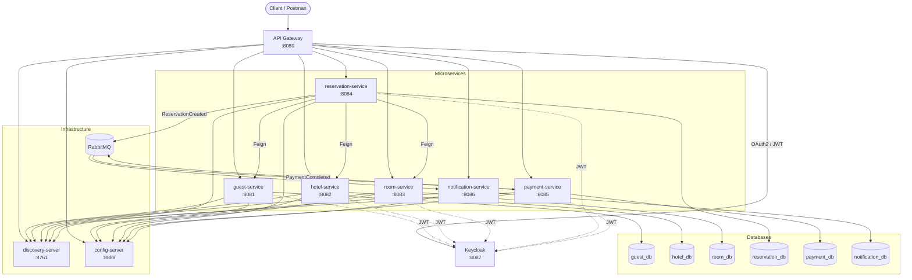

# Hotel Booking Microservices System

A production-like hotel booking platform built with **Java 21**, **Spring Boot 3.x**, and **Spring Cloud**. The system demonstrates synchronous REST communication (OpenFeign), asynchronous event-driven communication (RabbitMQ), service discovery (Eureka), centralized configuration (Config Server), API routing (Spring Cloud Gateway), resilience (Resilience4j), containerization (Docker), and authentication (KeyCloak).

## Business Logic

The platform supports the end-to-end hotel reservation workflow:

1. **Register guests** – store guest profile data (name, email, document).
2. **Manage hotels** – create and query hotel properties.
3. **Manage rooms** – define rooms per hotel with pricing, capacity, and availability.
4. **Create reservations** – guests book rooms for a date range.
5. **Validate reservation data** – reservation-service synchronously verifies guest, hotel, and room via OpenFeign.
6. **Calculate price** – total price = room price per night × number of nights.
7. **Publish reservation event** – `ReservationCreatedEvent` is sent to RabbitMQ.
8. **Process payment** – payment-service consumes the event and simulates payment (COMPLETED or FAILED).
9. **Publish payment event** – on success, `PaymentCompletedEvent` is published.
10. **Send notifications** – notification-service creates guest notifications for reservation and payment events.

Clients interact only with the **API Gateway** (`http://localhost:8080`). Internal services are discovered through Eureka.

## Microservices

| Service | Port | Responsibility |
|---------|------|----------------|
| discovery-server | 8761 | Netflix Eureka service registry |
| config-server | 8888 | Centralized configuration |
| api-gateway | 8080 | Single entry point, route to services |
| guest-service | 8081 | Guest CRUD |
| hotel-service | 8082 | Hotel CRUD |
| room-service | 8083 | Room CRUD and availability |
| reservation-service | 8084 | Reservations, Feign validation, event publishing |
| payment-service | 8085 | Payment processing, event consumption/publishing |
| notification-service | 8086 | Guest notifications from events |
| authentication | 8087 | KeyCloak authentication for clients |

## Architecture Overview



## Synchronous Communication

- **reservation-service** uses **OpenFeign** to call:
  - `guest-service` – verify guest exists
  - `hotel-service` – verify hotel exists
  - `room-service` – verify room exists and is available
- **Resilience4j circuit breakers** protect Feign calls when downstream services fail.
- **API Gateway** routes HTTP requests to registered Eureka services using `lb://service-name`.

## Asynchronous Communication

| Event | Publisher | Consumers |
|-------|-----------|-----------|
| `ReservationCreatedEvent` | reservation-service | payment-service, notification-service |
| `PaymentCompletedEvent` | payment-service | notification-service |

RabbitMQ exchanges and queues:

- `reservation.exchange` → `reservation.created.payment.queue`, `reservation.created.notification.queue`
- `payment.exchange` → `payment.completed.queue`

## Databases

Each business microservice uses its own PostgreSQL database (database-per-service pattern):

- `guest_db`, `hotel_db`, `room_db`, `reservation_db`, `payment_db`, `notification_db`

A single PostgreSQL container initializes all databases via `docker/postgres/init-databases.sql`.

## Spring Cloud Components

### Eureka Discovery Server
Services register on startup and discover peers dynamically. The API Gateway resolves service instances without hard-coded URLs.

### Config Server
Externalized configuration in `config-repo/` for ports, datasource URLs, Eureka URLs, and RabbitMQ settings. Services import config via:

```yaml
spring.config.import: optional:configserver:http://localhost:8888
```

### API Gateway
Routes paths such as `/guests/**`, `/hotels/**`, `/reservations/**` to the appropriate microservice through Eureka load balancing.

## Prerequisites

- Java 21
- Maven 3.9+
- Docker

## Docker and Docker Compose

Build and start the entire system:

```bash
docker compose up --build
```

This starts:

- PostgreSQL (port 5432)
- RabbitMQ (5672, management UI 15672)
- All infrastructure and business microservices
- API Gateway on port 8080

RabbitMQ management UI: http://localhost:15672 (guest / guest)

Eureka dashboard: http://localhost:8761

## Local Development (without Docker for apps)

1. Start PostgreSQL and RabbitMQ (or use `docker compose up postgres rabbitmq`).
2. Create databases using `docker/postgres/init-databases.sql`.
3. Start services in order:
   - discovery-server
   - config-server
   - guest-service, hotel-service, room-service
   - reservation-service, payment-service, notification-service
   - api-gateway

From the project root:

```bash
mvn -pl discovery-server spring-boot:run
mvn -pl config-server spring-boot:run
# ... other services
```

Or build all modules:

```bash
mvn clean package -DskipTests
```

## Running Tests

```bash
mvn test
```

Tests include:

- Unit tests for service layer logic (Mockito)
- Controller integration tests (MockMvc + H2)
- Reservation tests with mocked Feign clients and event publisher

## API Endpoints (via Gateway :8080)

### Guest Service
- `POST /guests`
- `GET /guests`
- `GET /guests/{id}`

### Hotel Service
- `POST /hotels`
- `GET /hotels`
- `GET /hotels/{id}`

### Room Service
- `POST /rooms`
- `GET /rooms`
- `GET /rooms/{id}`
- `GET /rooms/hotel/{hotelId}`
- `PATCH /rooms/{id}/availability`

### Reservation Service
- `POST /reservations`
- `GET /reservations`
- `GET /reservations/{id}`
- `PATCH /reservations/{id}/cancel`

### Payment Service
- `GET /payments/{id}`
- `GET /payments/reservation/{reservationId}`

### Notification Service
- `GET /notifications/{id}`
- `GET /notifications/guest/{guestId}`

## Example Request Bodies

**Create Guest**

```json
{
  "firstName": "Anna",
  "lastName": "Smith",
  "email": "anna.smith@example.com",
  "phoneNumber": "+1234567890",
  "documentNumber": "DOC-001"
}
```

**Create Hotel**

```json
{
  "name": "Grand Plaza Hotel",
  "address": "123 Main Street",
  "city": "New York",
  "country": "USA",
  "rating": 4.5
}
```

**Create Room**

```json
{
  "hotelId": 1,
  "roomNumber": "101",
  "roomType": "DELUXE",
  "pricePerNight": 150.00,
  "capacity": 2,
  "available": true
}
```

**Create Reservation**

```json
{
  "guestId": 1,
  "hotelId": 1,
  "roomId": 1,
  "checkInDate": "2026-08-01",
  "checkOutDate": "2026-08-04",
  "numberOfGuests": 2
}
```

**Update Room Availability**

```json
{
  "available": false
}
```

## Future Improvements

- **Prometheus + Grafana** – metrics and dashboards via Spring Boot Actuator
- **Kubernetes** – Helm charts and cloud-native deployment
- **Istio service mesh** – traffic management, observability
- Saga pattern for distributed transactions across reservation, payment, and room availability

## Project Structure

```
hotel-booking-microservices/
├── common-events/
├── discovery-server/
├── config-server/
├── api-gateway/
├── guest-service/
├── hotel-service/
├── room-service/
├── reservation-service/
├── payment-service/
├── notification-service/
├── config-repo/
├── docker/
├── .github/workflows/ci-cd.yml
├── docker-compose.yml
└── README.md
```
